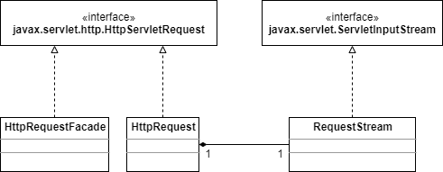

# 创建HttpRequest对象

HttpRequest实现了HttpServletRequest，它有一个外观类HttpRequestFacade。图3.2展示了HttpRequest及其相关的类。



HttpRequest的很多方法是空的（等到第4章会有完整实现），但是servlet程序员已经可以从中拿到请求头、cookies和参数了，这三个的值会存在下面这几个变量中：

```java
protected HashMap headers = new HashMap();
protected ArrayList cookies = new ArrayList();
protected ParameterMap parameters = null;
```

ParameterMap会在”获取参数“一节中讲到。

servlet程序员可以调用HttpServletRequest的方法获取请求的相关信息，这些方法有：getCookies,getDateHeader, getHeader, getHeaderNames, getHeaders, getParameter, getPrameterMap, getParameterNames, and getParameterValues。当正确填充了headers, cookies和parameters后，相关方法的实现就比较简单了，就像在HttpRequest中看到的那样。

当然，这里最主要的工作是解析请求并填充HttpRequest对象。对于headers和cookies，HttpRequest提供了addHeader和addCookie方法，当HttpProcessor调用parseHeaders方法时，它们就会被调用。Parameters则会在需要他们的时候，利用HttpRequest的parseParameters方法进行解析。所有的方法都会在下一节中讨论。

解析请求是一个很复杂的任务，我们会用几个小节来学习：

- 读取socket的输入流
- 解析请求行
- 解析请求头
- 解析cookies
- 获取parameters

