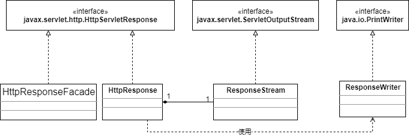

# 创建HttpResponse对象

HttpResponse实现了javax.servlet.http.HttpServletResponse接口，HttpResponseFacade是它的外观类，图3.3展示了它和它的相关类的类图。



在第2章中，HttpResponse只实现了部分功能，例如：它的getWriter()方法返回的PrintWriter对象在调用print()时并不会自动冲刷，本章的应用程序将会修复这个问题。为了了解它是怎么修复的，你需要先了解Writer。

在servlet里，可以使用PrintWrite向输出流写入字符，你可以使用任意编码，但是在向浏览器发送字符时，实际上都是字节流，所以第2章中HttpResponse的getWriter()方法是这样的：

```java
public PrintWriter getWriter() throws IOException {
    // autoflush is true, println() will flush,
    // but print() will not.
    writer = new PrintWriter(output, true);
    return writer;
  }
```

传入一个OutputStream实例来构造PrintWriter对象，你传给print()或者println()的数据都会被转化为字节流，然后通过OutputStream发送。

在本章中，将使用一个ResponseStream的实例作为PrintWriter的输出流。ResponseStream间接地实现了OutputStream。

ResponseWriter继承自PrintWriter，覆写了PrintWriter所有的print()和println()方法，使得在调用这些方法时会自动冲刷到OutputStream。

我们可以通过传入一个ResponseStream来实例一个ResponseWriter，但是在这里，我们会使用一个java.io.OutputStreamWriter对象来作为ResponseWriter和ResponseStream的桥梁。

使用OutputStreamWriter，写入其中的字符会使用给定的字符集进行编码转为字节，可以通过名称显示地指定字符集，或者使用平台默认的字符集。每次调用write方法，都会进行编码转换。在被写入输出流之前，这些字节会存储在缓冲区里，缓冲区的大小可以指定，但是默认的大小已经可以满足大部分需求了。**注意**：传递给write()方法的字符是没有缓冲的。

```java
public PrintWriter getWriter() throws IOException {
    ResponseStream newStream = new ResponseStream(this);
    newStream.setCommit(false);
    OutputStreamWriter osr = new OutputStreamWriter(newStream, getCharacterEncoding());
    writer = new ResponseWriter(osr);
    return writer;
}
```

