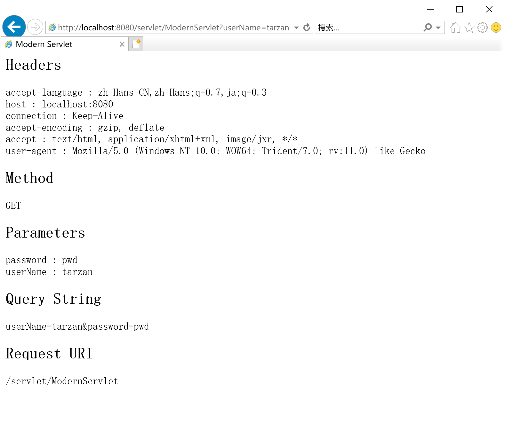

# 运行应用程序

要在Windows上运行应用程序，在工作目录使用如下命令：

```
java -classpath ./lib/servlet.jar;./ ex03.pyrmont.startup.Bootstrap 
```

在linux上，使用冒号分隔libraries：

```
java -classpath ./lib/servlet.jar:./ ex03.pyrmont.startup.Bootstrap
```

要显示index.html，使用如下URL：

```
http://localhost:8080/index.html 
```

要调用PrimitiveServlet，URL为：

```
http://localhost:8080/servlet/PrimitiveServlet 
```

你会在浏览器看到如下信息：

```
Hello. Roses are red. 
Violets are blue.
```

注释：在第2章中运行PrimitiveServlet，不会显示第二行。

你可以调用ModernServet，它在第2章中是无法运行的，URL为：

```
http://localhost:8080/servlet/ModernServlet
```

ModernServlet的源码可以在工作目录下webroot文件夹下找到。

你可以在URL后面添加query string来测试这个servlet，图3.4显示的是使用下面的网址调用ModernServlet的结果：

```
http://localhost:8080/servlet/ModernServlet?userName=tarzan&password=pwd
```

