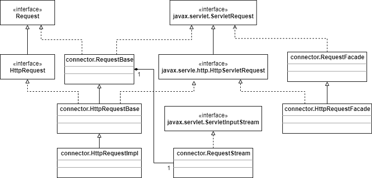

# Request Objects

org.apache.catalina.Request接口表示默认连接器中的请求对象，RequestBase直接实现了这个接口，它是HttpRequest的父接口。最终的实现类是HttpRequestImpl。和第3章一样，有两个外观类：RequestFacade和HttpRequestFacade。4.3展示了Request接口和实现的类图。注：图里不包括javax.servlet和javax.servlet.http包里的类，忽略了org.apache.catalina前缀。

如果你理解了第3章中的请求对象，理解这个图就没什么问题。