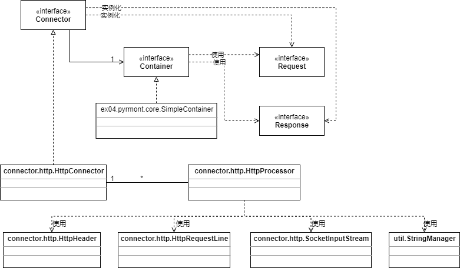

# 连接器接口

Tomcat的连接器必须实现org.apache.catalina.Connector接口，这个接口里的许多方法都是非常重要的，像getContainer()、 setContainer()、 createRequest()和createResponse()。

setContainer()用来把一个容器关联到这个连接器上，getContainer()返回关联的容器。createRequest()对收到的请求创建一个请求对象，createResponse()创建一个响应对象。

org.apache.catalina.connector.http.HttpConnector是连接器接口的一个实现类，会在下一节中讨论。现在，仔细看看图4.1展示的关于默认连接器的类图，注意，为了使类图简单点，省略了Request和Response接口的实现。图中除了SimpleContainer这个类外，都省略了org.apache.catalina前缀。

连接器和容器是一对一的关系，连接器知道要使用哪个容器。和第3章不同，HttpConnector和HttpProcessor是一对多的关系。