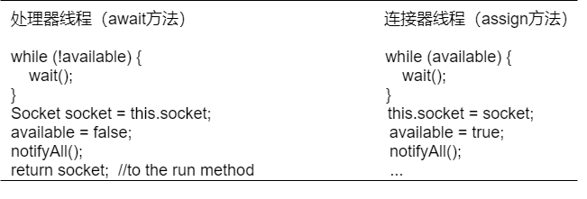

# The HttpProcessor Class

默认连接器中的HttpProcessor是第3章中同名类的完全版。你已经直到了它是怎么工作的，在本章中，我们更感兴趣的是HttpProcessor是怎样使assign()方法异步，以使得HttpConnector能够同时处理多个请求。

**注：**HttpProcessor中另一个比较重要的方法使process()，它会解析请求并调用容器的invoke()方法。

在第3章中，HttpConnector运行在自己的线程中，但是它还是必须等待当前请求处理完成之后才能处理下一个请求。下面使第3章中HttpConnector的run()方法的部分代码：

```java
public void run() {
    ...
    while (!stopped) {
        // Accept the next incoming connection from the server socket
        Socket socket = null;
        try {
            socket = serverSocket.accept();
        }
        catch (Exception e) {
            continue;
        }
        // Hand this socket off to an HttpProcessor
        HttpProcessor processor = new HttpProcessor(this);
        processor.process(socket);
    }
}
```

上面的process()方法是同步的，因此，run()方法在接收下一个请求之前必须先等待process()完成。

在默认的连接器中，HttpProcessor实现了Runnable接口，每一个HttpProcessor实例都会运行在它自己的线程中，我们称之为“处理器线程”。HttpConnector在创建每一个HttpProcessor实例时，都会调用实例的start()方法启动这个实例的处理器线程。下面是HttpProcessor的run()方法的代码：

```java
public void run() {
    // Process requests until we receive a shutdown signal
    while (!stopped) {
        // Wait for the next socket to be assigned
        Socket socket = await();
        if (socket == null)
            continue;
        // Process the request from this socket
        try {
            process(socket);
        } catch (Throwable t) {
            log("process.invoke", t);
        }
        // Finish up this request
        connector.recycle(this);
    }
    // Tell threadStop() we have shut ourselves down successfully
    synchronized (threadSync) {
        threadSync.notifyAll();
    }
}
```

while循环按照如下的顺序执行：获取套接字，处理它，调用连接器的recycle()方法来把当前的HttpProcessor对象放回连接器的对象池中。下面是HttpConenctor的recycle()方法：

```java
void recycle(HttpProcessor processor) {
    //        if (debug >= 2)
    //            log("recycle: Recycling processor " + processor);
    processors.push(processor);
}
```

注意，run()方法在执行到await()时会阻塞，直到它从HttpConenctor获得一个新的套接字，换句话说就是直到HttpConenctor调用HttpProcessor对象的assign()方法。然而，await()方法和assign()方法运行在不同的线程，assign()方法是在HttpConnector的run()方法里被调用的。运行HttpConnector的run()方法的这条线程我们叫做“连接器线程”。那么assign()方法是怎么告诉await()方法它被调用了呢？是通过一个叫available的布尔值变量，和使用Object的wait()、notifyAll()方法。

**注：**wait()方法会造成当前线程等待直到其他线程调用了这个对象的notify()或者notifyAll()方法。

下面是HttpProcessor的assign()和await()方法：

```java
synchronized void assign(Socket socket) {
    // Wait for the Processor to get the previous Socket
    while (available) {
        try {
            wait();
        } catch (InterruptedException e) {
        }
    }
    // Store the newly available Socket and notify our thread
    this.socket = socket;
    available = true;
    notifyAll();
    if ((debug >= 1) && (socket != null))
        log(" An incoming request is being assigned");
}

private synchronized Socket await() {
    // Wait for the Connector to provide a new Socket
    while (!available) {
        try {
            wait();
        } catch (InterruptedException e) {
        }
    }
    // Notify the Connector that we have received this Socket
    Socket socket = this.socket;
    available = false;
    notifyAll();
    if ((debug >= 1) && (socket != null))
        log("  The incoming request has been awaited");
    return (socket);
}
```

图4.2展示了这两个方法的程序流：



当处理器线程刚刚启动时，available为false，所以这条线程在while循环里等待，直到另外一条线程调用notify或者notifyAll方法。也就是说，调用wait方法使得这条处理器线程暂停，直到连接器线程调用这个HttpProcessor对象的notifyAll方法。

当一个新的socket被指定的时候，连接器线程调用HttpProcessor的assign方法，available为false，所以跳过while循环，这个socket被指定到当前HttpProcessor对象的socket变量上：

```java
this.socket = socket;
```

然后，连接器线程将变量available设置为true并调用notifyAll()。它会唤醒处理器线程，此时available已经为true了，处理器线程跳出while循环，获取当前HttpProcessor对象的socket值，设置available为false，调用notifyAll并返回获取到的socket。

为什么await方法要使用一个局部变量（socket）而不直接返回当前对象的socket呢？（*原文是这样写的：这是为了在当前socket处理完成之前就能够接收下一个socket，感觉不太对*）

为什么await方法要调用notifyAll呢？是为了防止当avaliable变量还是true的时候，又有socket到来（比如处理器线程还没执行到available = false），在这种情况下，连接器线程就会阻塞在while循环里，所以就需要处理器线程在将available设为false之后调用notifyAll来唤醒连接器线程。