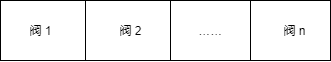

# 管道任务

本节将解释当连接器调用容器的invoke()方法时会发生什么。然后在子章节中讨论org.apache.catalina包中四个相关的接口：Pipeline、Valve、ValveContext和Contained。

管道包含容器将要调用的任务。一个阀表示一个具体的任务。容器的管道中有一个基础阀，你也可以添加任意你需要的阀。阀的数量指的是额外添加的阀的数量，即不包含基础阀。通过编辑Tomcat的配置文件(server.xml)可以动态地添加阀。图5.2展示了一条管道和它的阀。



如果你对servlet过滤器有所了解，那么要想象一条管道和它的阀是怎样工作的就不困难了。管道就像一条过滤器链，每个阀是一个过滤器。和过滤器一样，阀可以操作传递给它的请求和响应对象。一个阀处理完成后，它会调用管道中的下一个阀进行处理。基础阀总是在最后被调用。

一个container有一条管道。当container的invoke()方法被调用时，container会将处理工作交给它的管道，管道调用它里面的第一个阀，处理完后调用下一个阀，直到管道里的阀都被调用了。你也许会猜测管道的invoke()方法是像下面这样的：

```
// invoke each valve added to the pipeline
for(int n=0;n<valves.length;n++){
	valve[n].invoke(...);
}
// then,invoke the basic valve
basicValve.invoke(...);
```

然而，Tomcat的设计者选择了不同的方式，通过引入org.apache.catalina.ValveContext接口。下面是它的工作原理。

当容器调用invoke()方法时，并没有把任务硬编码在invoke方法中，而是会调用它的管道的invoke()方法。Pipeline接口的invoke方法签名如下，它和container接口中的invoke方法是一样的。

```java
public void invoke(Request request,Response response) throws IOException,ServletException;
```

下面是ContainerBase类对于Container接口的invoke()方法的实现：

```java
public void invoke(Request request, Response response) throws IOException,ServletException {
    pipeline.invoke(request, response);
}
```

pipeline是container里一个Pipeline接口的实例。

现在，管道必须确保它里面添加的阀和基础阀都被调用一次，它是通过创建一个ValveContext实例来实现的。ValveContext的实现类是管道的内部类，所以它可以访问这条管道的所有成员。ValveContext接口最重要的方法是invokeNext()：

```java
public void invokeNext(Request request, Response response) throws IOException, ServletException;
```

创建了一个ValveContext实例之后，管道会调用这个ValveContext的invokeNext()方法，ValveContext实例会调用管道的第一个阀，第一个阀在任务完成之前会调用下一个阀。ValveContext会把自身传递给每一个阀，所以每一个阀都能调用ValveContext的invokeNext()方法。下面是Valve接口的invoke方法的签名：

```java
public void invoke(Request request, Response response, ValveContext context) throws IOException, ServletException;
```

一个阀的invoke方法的实现会像下面这样：

```java
public void invoke(Request request, Response response, ValveContext valveContext) throws IOException, ServletException {
    // Pass the request and reponse on to the next valve in out pipeline
    valveContext.invokeNext(request, response);
    // now perform what this valve is supposed to do
    ...
}
```

org.apache.catalina.core.StandardPipeline是Pipeline在所有container中的实现，在Tomcat 4中，StandardPipeline有一个内部类叫做StandarPipelineValveContext，它实现了ValveContext接口，下面是StandarPipelineValveContext的代码：

```java
protected class StandardPipelineValveContext implements ValveContext {
    protected int stage = 0;
    
    public String getInfo() {
            return info;
    }
    
    public void invokeNext(Request request, Response response)
        throws IOException, ServletException {

        int subscript = stage;
        stage = stage + 1;

        // Invoke the requested Valve for the current request thread
        if (subscript < valves.length) {
            valves[subscript].invoke(request, response, this);
        } else if ((subscript == valves.length) && (basic != null)) {
            basic.invoke(request, response, this);
        } else {
            throw new ServletException(sm.getString("standardPipeline.noValve"));
        }
    }
}
```

invokeNext方法使用stage和subscript来标明当前正在调用的阀。当这个方法第一次被调用时，subscript为0，stage为1，所以第一个阀(数组下标为0)被调用。第一个阀接收到此ValveContext对象并再次调用invokeNext()方法，此时，subscript为1，stage为2，就会继续调用第2个阀，依次类推。

当invokeNext方法被最后一个阀调用时，subscript的值等于阀的数量，基本阀就会被调用。

Tomcat 5从StandardPipeline中移除了StandarPipelineValveContext，取而代之的是依赖于org.apache.catalina.core.StandardValveContext，StandardValveContext的代码如下：

```java
package org.apache.catalina.core;

import java.io.IOException; 
import javax.servlet.ServletException; 
import org.apache.catalina.Request; 
import org.apache.catalina.Response; 
import org.apache.catalina.Valve; 
import org.apache.catalina.ValveContext; 
import org.apache.catalina.util.StringManager; 

public final class StandardValveContext implements ValveContext { 
    protected static StringManager sm = StringManager.getManager(Constants.Package); 		protected String info = "org.apache.catalina.core.StandardValveContext/1.0"; 			protected int stage = 0; 
    protected Valve basic = null; 
    protected Valve valves[] = null; 
    
    public String getInfo() { 
        return info;
	} 
    
    public final void invokeNext(Request request, Response response) throws IOException, ServletException { 
        int subscript = stage; 
        stage = stage + 1; 
        // Invoke the requested Valve for the current request thread 
        if (subscript < valves.length) {
            valves[subscript].invoke(request, response, this); 
        } 
        else if ((subscript == valves.length) && (basic != null)) { 
            basic.invoke(request, response, this); 
        } 
        else { 
            throw new ServletException (sm.getString("standardPipeline.noValve")); 
        } 
    } 
    
    void set(Valve basic, Valve valves[]) { 
        stage = 0; 
        this.basic = basic; 
        this.valves = valves; 
    } 
}
```

我们下面会详细介绍Pipeline、Valve和ValveContext接口，还会介绍一个阀类通常都会实现的接口org.apache.catalina.Contained。