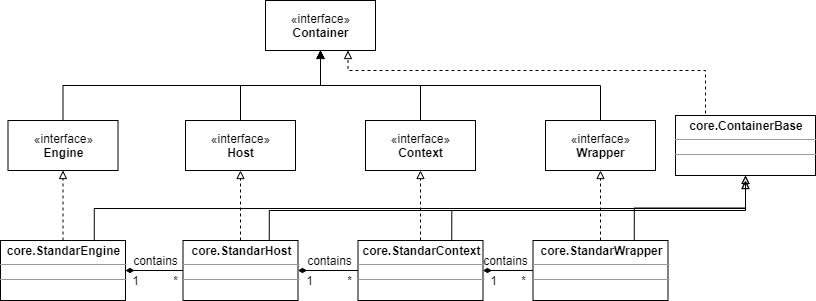

# Container接口

一个容器必须实现org.apache.catalina.Container接口。正如第4章所讲，需要向连接器的setContainer()方法传递一个Container实例，这样连接器才能调用容器的invoke()方法。回顾一下第4章Bootstrap里的代码：

```java'
HttpConnector connector = new HttpConnector();
SimpleContainer container = new SimpleContainer();
connector.setContainer(container);
```

对于Catalina中的容器，第一件需要注意的事情是一共有四种类型的容器，分别对应了不同的概念层次：

Engine：表示整个Catalina servlet引擎

Host：表示包含一个或多个context的虚拟主机

Context：表示一个web应用。一个context里包含一个或多个wrapper

Wrapper：表示一个单独的servlet

每一个概念层次都会用一个org.apache.catalina包里的接口来表示，这些接口有Engine、Host、Context和Wrapper。这四个接口都继承与Container。这四个容器的标准实现分别是StandarEngine、StandarHost、StandarContext和StandarWrapper，他们都在org.apache.catalina.core包里。

图5.1是Container接口和它的子接口以及实现类的类图。注意，所有接口都在org.apache.catalina包里，所有类都在org.apache.catalina.core包里。



注意，所有的实现类都继承于ContainerBase，它是一个抽象类。

一个功能性的Catalina部署并不是这四种容器都必须拥有，本章第一个应用程序的container模块就只有一个wrapper，第2个应用程序有一个wrapper和一个context。在本章的应用程序里，host和engine是不需要的。

一个高层次的容器可以有一个或多个低层次的子容器。举个例子，一个context往往有一个或多个wrapper，一个host可以没有或者有多个context。wrapper是最低层次的，它不包含子容器。你可以使用Container接口的addChild()方法来添加子容器，方法签名如下：

```java
public void addChild(Container child);
```

移除子容器可以使用removeChild()方法：

```java
public void removeChild(Container child);
```

可以通过findChild()或者findChildren()方法来查找一个或者所有的子容器：

```java
public Container findChild(String name);
public Container[] findChildren();
```

一个container也会包含一些支持的组件，像Loader、Logger、Manager、Realm和Resources。我们会在稍后讨论这些组件。Container提供了get、set方法来关联这些组件。

在部署Tomcat的时候，管理员可以通过配置文件（server.xml）来决定使用哪个容器，这是通过在容器中引入管道和阀来实现的。

注意，Tomcat 4的容器接口和Tomcat 5的稍有不同，例如，4里面有一个map方法，5里面把这个方法移除了。