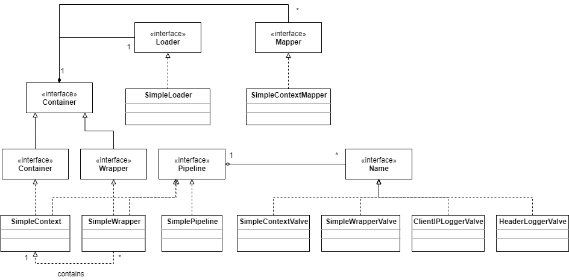

# Context应用程序

在第一个应用程序中，我们看到了怎么部署只含有一个wrapper的简单web应用，这个应用只有一个servlet。尽管有一些应用只需要单servlet，但是大部分的web应用还是需要更多的servlet。在这些应用里面，你需要一个和wrapper不同类型的容器，你需要一个context。

这第2个应用程序示范了该怎样使用context，这个context里有两个wrapper，包装了两个servlet类。当有多个wrapper时，你需要一个mapper，这个组件能够帮助我们从容器中（本例中即为一个context中）选择一个子容器来处理特定的请求。

注：只有在Tomcat 4中才有这个mapper，Tomcat 5是采用另外的方式来寻找子容器的。

在这个应用程序中，mapper是一个ex05.pyrmont.core.SimpleContextMapper类的实例，它实现了org.apache.catalina.Mapper接口。一个容器能够使用多个mapper来支持多种协议。在本例中，一个mapper支持一种协议。举例来说，一个容器可能会有一个mapper用来支持HTTP协议，用另一个mapper来支持HTTPS协议。下面是Mapper接口的代码：

```java
package org.apache.catalina;

public interface Mapper {
    public Container getContainer();
    public void setContainer(Container container);
    public String getProtocol ();
    public void setProtocol(String protocol);
    public Container map(Request request, boolean update);
}
```

getContainer返回与这个mapper关联的container，setContainer就是将容器关联到mapper。getProtocol返回这个mapper负责的协议， setProtocol设置这个mapper要负责的协议名字。map方法返回一个子容器，这个子容器会处理特定的请求。

图5.4是这个程序的类图



SimpleContext表示一个context，它使用SimpleContextMapper作为它的mapper，SimpleContextValve是它的基础阀，还添加了两个阀：ClientIpLoggerValve和HeaderLoggerValve。context还有两个wrapper——SimpleWrapper，它们使用SimpleWrapperValve作为基础阀，除此之外就没有添加阀了。

这个应用程序使用了同样的loader和另外两个阀，但是，loader和阀现在不是和wrapper关联了，而是和context关联，这样，loader就可以被所有的wrapper使用。context作为一个container关联到连接器，因此，每当连接器接收到请求时都会调用context的invoke方法。如果你理解了前面讲的内容，下面这些就不难理解了：

1. 一个container有一条管道，container的invoke方法会调用这条管道的invoke方法。
2. 管道的invoke方法会调用所有添加到这个container的阀，然后调用基础阀的invoke。
3. 在wrapper中，基础阀负责加载关联的servlet并响应请求。
4. 在包含子container的context中，基础阀使用一个mapper来寻找子container，子container负责处理请求。如果找到了子container，它会调用子container的invoke方法，然后回到步骤1。

现在我们来看看处理的顺序。

SimpleContext的invoke方法调用它的管道的invoke方法。

```java
public void invoke(Request request, Response response)
    throws IOException, ServletException {
    pipeline.invoke(request, response);
}
```

SimplePipeline表示管道，它的invoke方法如下：

```java
public void invoke(Request request, Response response)throws IOException, ServletException {
    // Invoke the first Valve in this pipeline for this request
    (new SimplePipelineValveContext()).invokeNext(request, response);
}
```

前面已经讲过，它会调用添加的所有阀，然后调用基础阀的invoke方法。在SimpleContext中，基础阀是SimpleContextValve。在SimpleContextValve的invoke方法中，它会使用context的mapper来寻找wrapper：

```java
Context context = (Context) getContainer();
// Select the Wrapper to be used for this Request
Wrapper wrapper = null;
try {
	wrapper = (Wrapper) context.map(request, true);
}
catch (IllegalArgumentException e) {
    badRequest(requestURI, (HttpServletResponse) response.getResponse());
    return;
}
if (wrapper == null) {
    notFound(requestURI, (HttpServletResponse) response.getResponse());
    return;
}
// Ask this Wrapper to process this Request
response.setContext(context);
wrapper.invoke(request, response);
```

如果找到了wrapper，就会调用wrapper的invoke。

这个应用程序中，SimpleWrapper表示一个wrapper，下面是SimpleWrapper的invoke方法，它和SimpleContext中的invoke方法是完全一致的：

```java
public void invoke(Request request, Response response)
    throws IOException, ServletException {
    pipeline.invoke(request, response);
}
```

pipeline是一个SimplePipeline实例，它的invoke方法已经在上面列出了。本节的wrapper除了基础阀没有添加其他的阀，基础阀是SimpleWrapperValve，管道的invoke方法会调用基础阀的invoke，分配一个servlet并调用servlet的service，就像在上节中看到的一样。

注意：这里wrapper没有关联的loader，但是context有，因此，getLoader方法会返回父container（即context）的loader。

下面会讨论SimpleContext,、SimpleContextValve、 SimpleContextMapper和Bootstrap2这四个类。

## ex05.pyrmont.core.SimpleContextValve

SimpleContextValve是SimpleContext的基础阀，它最重要的方法是invoke，如下：

```java
public void invoke(Request request, Response response, ValveContext valveContext)
    throws IOException, ServletException {
    // Validate the request and response object types
    if (!(request.getRequest() instanceof HttpServletRequest) ||
      !(response.getResponse() instanceof HttpServletResponse)) {
      return;     // NOTE - Not much else we can do generically
    }

    // Disallow any direct access to resources under WEB-INF or META-INF
    HttpServletRequest hreq = (HttpServletRequest) request.getRequest();
    String contextPath = hreq.getContextPath();
    String requestURI = ((HttpRequest) request).getDecodedRequestURI();
    String relativeURI =
      requestURI.substring(contextPath.length()).toUpperCase();

    Context context = (Context) getContainer();
    // Select the Wrapper to be used for this Request
    Wrapper wrapper = null;
    try {
      wrapper = (Wrapper) context.map(request, true);
    }
    catch (IllegalArgumentException e) {
      badRequest(requestURI, (HttpServletResponse) response.getResponse());
      return;
    }
    if (wrapper == null) {
      notFound(requestURI, (HttpServletResponse) response.getResponse());
      return;
    }
    // Ask this Wrapper to process this Request
    response.setContext(context);
    wrapper.invoke(request, response);
  }
```

## ex05.pyrmont.core.SimpleContextMapper

SimpleContextMapper实现了Tomcat 4里的Mapper接口，它会与一个SimpleContext实例关联。

```java
package ex05.pyrmont.core;

import javax.servlet.http.HttpServletRequest;
import org.apache.catalina.Container;
import org.apache.catalina.HttpRequest;
import org.apache.catalina.Mapper;
import org.apache.catalina.Request;
import org.apache.catalina.Wrapper;

public class SimpleContextMapper implements Mapper {

  /**
   * The Container with which this Mapper is associated.
   */
  private SimpleContext context = null;

  public Container getContainer() {
    return (context);
  }

  public void setContainer(Container container) {
    if (!(container instanceof SimpleContext))
      throw new IllegalArgumentException
        ("Illegal type of container");
    context = (SimpleContext) container;
  }

  public String getProtocol() {
    return null;
  }

  public void setProtocol(String protocol) {
  }


  /**
   * Return the child Container that should be used to process this Request,
   * based upon its characteristics.  If no such child Container can be
   * identified, return <code>null</code> instead.
   *
   * @param request Request being processed
   * @param update Update the Request to reflect the mapping selection?
   *
   * @exception IllegalArgumentException if the relative portion of the
   *  path cannot be URL decoded
   */
  public Container map(Request request, boolean update) {
    // Identify the context-relative URI to be mapped
    String contextPath =
      ((HttpServletRequest) request.getRequest()).getContextPath();
    String requestURI = ((HttpRequest) request).getDecodedRequestURI();
    String relativeURI = requestURI.substring(contextPath.length());
    // Apply the standard request URI mapping rules from the specification
    Wrapper wrapper = null;
    String servletPath = relativeURI;
    String pathInfo = null;
    String name = context.findServletMapping(relativeURI);
    if (name != null)
      wrapper = (Wrapper) context.findChild(name);
    return (wrapper);
  }
}
```

如果传给setContainer方法的参数不是SimpleContext类型，它会抛出一个IllegalArgumentException异常。map方法返回一个子container(一个wrapper)负责处理请求，map方法有两个参数：一个请求对象和一个布尔值，这个实现里面忽略了第二个参数。map方法会从请求对象里面拿到context path，并使用context的findServletMapping方法来获得与这个path相关联的名字。如果找到了名字，就使用context的findChild方法得到一个Wrapper实例。

## ex05.pyrmont.core.SimpleContext

SimpleContext是本例中context的实现，它是与连接器相关联的主容器，但是，处理每个特定的servlet是由wrapper来完成的。这个应用程序里面有两个servlet，PrimitiveServlet和ModernServlet，就有两个wrapper。每个wrapper都有一个名字，PrimitiveServlet的wrapper名字是Primitive，ModernServlet的wrapper名字是Modern。为了让SimpleContext知道该选择哪一个wrapper来调用，就必须要把请求的URI和wrapper的名字映射起来。本例中，有两个URI会用来调用两个wrapper，第一个是 /Primitive，它会映射到Primitive wrapper上，另一个是 /Modern，它会映射到Moderen wrapper。当然，你也可以把多个URI映射到一个servlet上。

这里有一些SimpleContext必须实现的Container和Context接口的方法。大部分方法是空的，但与映射相关的方法都给出了具体的实现代码，这些方法如下：

- addServletMapping。添加URI和wrapper名字的键值对，会根据URI映射的名字来调用相应的wrapper。
- findServletMapping。获取URI映射的wrapper名字。这个方法用来查找针对特定的URI该调用哪个wrapper。如果给的URI还没有使用addServletMapping进行注册，它会返回null。
- addMapper。添加一个mapper到context。SimpleContext声明了一个mapper变量和一个mappers变量，mapper变量表示默认的mapper，mappers包含了这个SimpleContext对象包含的所有mapper。第一个添加到这个context的mapper会变成默认mapper。
- findMapper。查找合适的mapper。在SimpleContext中，它会返回默认的mapper。
- map。返回负责处理这个请求的wrapper。

另外，SimpleContext还提供了几个实现：addChild、findChild和findChildren方法。addChild添加一个wapper到这个context，findChild根据名字查找wrapper，findChildren查找所有的wrapper。

## ex05.pyrmont.startup.Bootstrap2

Bootstrap2用来启动应用程序，它和BootStrap1类似。

```java
package ex05.pyrmont.startup;

import ex05.pyrmont.core.SimpleContext;
import ex05.pyrmont.core.SimpleContextMapper;
import ex05.pyrmont.core.SimpleLoader;
import ex05.pyrmont.core.SimpleWrapper;
import ex05.pyrmont.valves.ClientIPLoggerValve;
import ex05.pyrmont.valves.HeaderLoggerValve;
import org.apache.catalina.Context;
import org.apache.catalina.Loader;
import org.apache.catalina.Mapper;
import org.apache.catalina.Pipeline;
import org.apache.catalina.Valve;
import org.apache.catalina.Wrapper;
import org.apache.catalina.connector.http.HttpConnector;

public final class Bootstrap2 {
  public static void main(String[] args) {
    HttpConnector connector = new HttpConnector();
    Wrapper wrapper1 = new SimpleWrapper();
    wrapper1.setName("Primitive");
    wrapper1.setServletClass("PrimitiveServlet");
    Wrapper wrapper2 = new SimpleWrapper();
    wrapper2.setName("Modern");
    wrapper2.setServletClass("ModernServlet");

    Context context = new SimpleContext();
    context.addChild(wrapper1);
    context.addChild(wrapper2);

    Valve valve1 = new HeaderLoggerValve();
    Valve valve2 = new ClientIPLoggerValve();

    ((Pipeline) context).addValve(valve1);
    ((Pipeline) context).addValve(valve2);

    Mapper mapper = new SimpleContextMapper();
    mapper.setProtocol("http");
    context.addMapper(mapper);
    Loader loader = new SimpleLoader();
    context.setLoader(loader);
    // context.addServletMapping(pattern, name);
    context.addServletMapping("/Primitive", "Primitive");
    context.addServletMapping("/Modern", "Modern");
    connector.setContainer(context);
    try {
      connector.initialize();
      connector.start();

      // make the application wait until we press a key.
      System.in.read();
    }
    catch (Exception e) {
      e.printStackTrace();
    }
  }
}
```

main方法一开始，实例化Tomcat的默认连接器和两个wrapper：wrapper1和wrapper2，这两个wrapper的名字为Primitive和Modern，它们对应的servlet是PrimitiveServlet和ModernServlet。

```java
HttpConnector connector = new HttpConnector();
Wrapper wrapper1 = new SimpleWrapper();
wrapper1.setName("Primitive");
wrapper1.setServletClass("PrimitiveServlet");
Wrapper wrapper2 = new SimpleWrapper();
wrapper2.setName("Modern");
wrapper2.setServletClass("ModernServlet");
```

然后创建SimpleContext，并添加这两个wrapper作为它的子container。实例化两个阀，ClientIPLoggerValve和HeaderLoggerValve，并把它们添加到SimpleContext。

```java
Context context = new SimpleContext();
context.addChild(wrapper1);
context.addChild(wrapper2);

Valve valve1 = new HeaderLoggerValve();
Valve valve2 = new ClientIPLoggerValve();

((Pipeline) context).addValve(valve1);
((Pipeline) context).addValve(valve2);
```

接着，构造一个SimpleMapper对象并把它添加到SimpleContext。这个mapper负责查找在这个context该使用哪个子container来处理请求。

```java
Mapper mapper = new SimpleContextMapper();
mapper.setProtocol("http");
context.addMapper(mapper);
```

为了加载servlet，需要一个loader。这里使用SimpleLoader，和上一个应用程序一样。然而，这个loader不是添加到wrapper上，而是添加到context上。wrapper调用getLoader方法时就能找到这个loader，因为context是wrapper的父container。

```java
Loader loader = new SimpleLoader();
context.setLoader(loader);
```

现在该添加servlet映射了，这里为两个wrapper添加两个映射。

```java
// context.addServletMapping(pattern, name);
context.addServletMapping("/Primitive", "Primitive");
context.addServletMapping("/Modern", "Modern");
```

最后，把连接器和这个context关联起来，初始化并启动连接器。

```java
connector.setContainer(context);
try {
   	connector.initialize();
   	connector.start();
```

