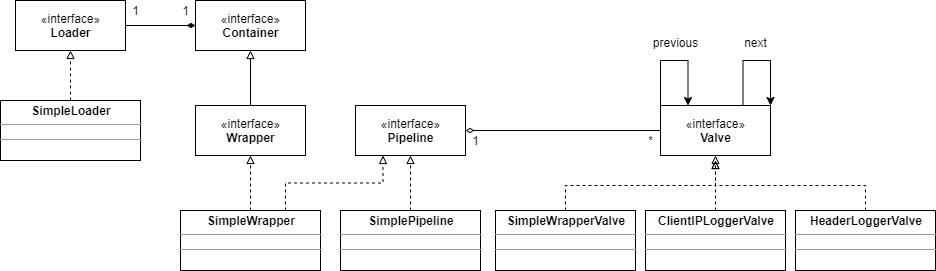

# Wrapper应用程序

本应用程序展示了如何编写一个最小化的container模块。核心类是ex05.pyrmont.core.SimpleWrapper，它实现了Wrapper接口。SimpleWrapper类含有一个Pipeline(实现类是ex05.pyrmont.core.SimplePipeline)，使用一个Loader(ex05.pyrmont.core.SimpeLoader)来加载servlet。Pipeline包含一个基础阀(ex05.pyrmont.core.SimpleWrapperValve)和两个添加的阀(ex05.pyrmont.core.ClientIPLoggerValve和ex05.pyrmont.core.HeaderLoggerValve)。类图如下：



这里使用的是Tomcat 4默认的连接器。

这个Wrapper包装了一个ModernServlet，ModernServlet在先前的章节中已经使用过了。一个servlet容器中只包含了一个wrapper。这些类都没开发完整，只实现了需要的方法。

## ex05.pyrmont.core.SimpleLoader

加载servlet的任务交给了Loader的实现，在本应用程序中，就是SimpleLoader。它知道servlet类的位置，它的getClassLoader方法返回一个ClassLoader实例，这个实例会寻找servlet的位置。SimpleLoader类声明了三个变量，第一个是WEB_ROOT，它指向了servlet的查找目录。

```java
public static final String WEB_ROOT = System.getProperty("user.dir") + File.separator  + "webroot";
```

另外两个变量是ClassLoader和Container对象的引用：

```java
ClassLoader classLoader = null;
Container container = null;
```

SimpleLoader的构造器初始化了一个类加载器，SimpleWrapper对象就可以拿到了。

```java
public SimpleLoader() {
    try {
        URL[] urls = new URL[1];
        URLStreamHandler streamHandler = null;
        File classPath = new File(WEB_ROOT);
        String repository = (new URL("file", null, classPath.getCanonicalPath() + File.separator)).toString() ;
      	urls[0] = new URL(null, repository, streamHandler);
      	classLoader = new URLClassLoader(urls);
    }
    catch (IOException e) {
      	System.out.println(e.toString() );
    }
}
```

构造器中的代码用来初始化类加载器，在先前的章节中已经见过了，这里不再解释。

container变量表示这个loader关联的container。

Loader还会在第8章更详细的讨论。

## ex05.pyrmont.core.SimplePipeline

SimplePipeline实现了Pipeline接口，最重要的就是invoke方法，它里面包含了一个内部类SimplePipelineValveContext。SimplePipelineValveContext实现了ValveContext接口，已经在管道任务里解释过了。

## ex05.pyrmont.core.SimpleWrapper

SimpleWrapper实现了Wrapper接口，提供了allocate和load方法的实现。除此之外，它还声明了如下两个变量：

```java
private Loader loader;
protected Container parent = null;
```

loader变量是一个Loader，它是用来加载servlet的。parent变量表示这个wrapper的父容器，意味着这个wrapper可以是另一个容器的子容器，比如一个Context。

下面是它的getLoader方法：

```java
public Loader getLoader() {
    if (loader != null)
      	return (loader);
    if (parent != null)
      	return (parent.getLoader());
    return (null);
}
```

getLoader方法返回一个Loader，如果这个wrapper有关联的loader就直接返回它，如果没有，就会返回父容器的loader，如果没有父容器，方法就会返回null。

SimpleWrapper有一条管道，并会为这条管道设置一个基础阀。你可以在它的构造器中看到：

```java
public SimpleWrapper() {
    pipeline.setBasic(new SimpleWrapperValve());
}
```

pipeline是声明过的一个SimplePipeline实例：

```java
private SimplePipeline pipeline = new SimplePipeline(this);
```

## ex05.pyrmont.core.SimpleWrapperValve

SimpleWrapperValve是一个基础阀，专门用来处理对于SimpleWrapper类的请求。它实现了Valve和Contained接口，最重要的方法是invoke。

```java
public void invoke(Request request, Response response, ValveContext valveContext) throws IOException, ServletException {

    SimpleWrapper wrapper = (SimpleWrapper) getContainer();
    ServletRequest sreq = request.getRequest();
    ServletResponse sres = response.getResponse();
    Servlet servlet = null;
    HttpServletRequest hreq = null;
    if (sreq instanceof HttpServletRequest)
      	hreq = (HttpServletRequest) sreq;
    HttpServletResponse hres = null;
    if (sres instanceof HttpServletResponse)
      	hres = (HttpServletResponse) sres;

    // Allocate a servlet instance to process this request
    try {
      	servlet = wrapper.allocate();
      	if (hres!=null && hreq!=null) {
        	servlet.service(hreq, hres);
      	}
      	else {
        	servlet.service(sreq, sres);
      	}
    }
    catch (ServletException e) {
    }
}
```

因为SimpleWrapperValve被用作一个基础阀，所以它的invoke方法不会再调用ValveContext的invokeNext方法。invoke方法调用SimpleWrapper的allocate方法获取一个servlet实例，然后调用servlet的service方法。注意，这个基础阀调用的servlet的service方法而不是wrapper的方法。

## ex05.pyrmont.valves.ClientIPLoggerValve

ClientIPLoggerValve会打印出客户端的ip地址。代码如下：

```java
package ex05.pyrmont.valves;

import java.io.IOException;
import javax.servlet.ServletRequest;
import javax.servlet.ServletException;
import org.apache.catalina.Request;
import org.apache.catalina.Response;
import org.apache.catalina.Valve;
import org.apache.catalina.ValveContext;
import org.apache.catalina.Contained;
import org.apache.catalina.Container;


public class ClientIPLoggerValve implements Valve, Contained {

  protected Container container;

  public void invoke(Request request, Response response, ValveContext valveContext)
    throws IOException, ServletException {

    // Pass this request on to the next valve in our pipeline
    valveContext.invokeNext(request, response);
    System.out.println("Client IP Logger Valve");
    ServletRequest sreq = request.getRequest();
    System.out.println(sreq.getRemoteAddr());
    System.out.println("------------------------------------");
  }

  public String getInfo() {
    return null;
  }

  public Container getContainer() {
    return container;
  }

  public void setContainer(Container container) {
    this.container = container;
  }
}
```

看invoke方法，首先会调用valveContext的invokeNext方法，这样就会调用管道中的下一个阀。然后打印一些字符串，从请求中获取ip地址并打印。

## ex05.pyrmont.valves.HeaderLoggerValve

这个类和ClientIPLoggerValve相似，它是用来打印请求头信息的。

```java
package ex05.pyrmont.valves;

import java.io.IOException;
import java.util.Enumeration;
import javax.servlet.ServletRequest;
import javax.servlet.ServletException;
import javax.servlet.http.HttpServletRequest;
import org.apache.catalina.Request;
import org.apache.catalina.Response;
import org.apache.catalina.Valve;
import org.apache.catalina.ValveContext;
import org.apache.catalina.Contained;
import org.apache.catalina.Container;


public class HeaderLoggerValve implements Valve, Contained {

  protected Container container;

  public void invoke(Request request, Response response, ValveContext valveContext)
    throws IOException, ServletException {

    // Pass this request on to the next valve in our pipeline
    valveContext.invokeNext(request, response);

    System.out.println("Header Logger Valve");
    ServletRequest sreq = request.getRequest();
    if (sreq instanceof HttpServletRequest) {
      HttpServletRequest hreq = (HttpServletRequest) sreq;
      Enumeration headerNames = hreq.getHeaderNames();
      while (headerNames.hasMoreElements()) {
        String headerName = headerNames.nextElement().toString();
        String headerValue = hreq.getHeader(headerName);
        System.out.println(headerName + ":" + headerValue);
      }

    }
    else
      System.out.println("Not an HTTP Request");

    System.out.println("------------------------------------");
  }

  public String getInfo() {
    return null;
  }

  public Container getContainer() {
    return container;
  }

  public void setContainer(Container container) {
    this.container = container;
  }
}
```

同样，它的invoke方法做的第一件事是调用valveContext的invokeNext方法，然后打印头信息。

## ex05.pyrmont.startup.Bootstrap1

Bootstrap1用来启动应用程序。

```java
package ex05.pyrmont.startup;

import ex05.pyrmont.core.SimpleLoader;
import ex05.pyrmont.core.SimpleWrapper;
import ex05.pyrmont.valves.ClientIPLoggerValve;
import ex05.pyrmont.valves.HeaderLoggerValve;
import org.apache.catalina.Loader;
import org.apache.catalina.Pipeline;
import org.apache.catalina.Valve;
import org.apache.catalina.Wrapper;
import org.apache.catalina.connector.http.HttpConnector;

public final class Bootstrap1 {
  public static void main(String[] args) {

/* call by using http://localhost:8080/ModernServlet,
   but could be invoked by any name */

    HttpConnector connector = new HttpConnector();
    Wrapper wrapper = new SimpleWrapper();
    wrapper.setServletClass("ModernServlet");
    Loader loader = new SimpleLoader();
    Valve valve1 = new HeaderLoggerValve();
    Valve valve2 = new ClientIPLoggerValve();

    wrapper.setLoader(loader);
    ((Pipeline) wrapper).addValve(valve1);
    ((Pipeline) wrapper).addValve(valve2);

    connector.setContainer(wrapper);

    try {
      connector.initialize();
      connector.start();

      // make the application wait until we press a key.
      System.in.read();
    }
    catch (Exception e) {
      e.printStackTrace();
    }
  }
}
```

在创建了HttpConnector和SimpleWrapper实例后，通过setServletClass方法告诉wrapper需要加载的类的名字。

```java
wrapper.setServletClass("ModernServlet");
```

然后创建了一个loader和两个valve，并把这个loader设置到wrapper上去。

```java
Loader loader = new SimpleLoader();
Valve valve1 = new HeaderLoggerValve();
Valve valve2 = new ClientIPLoggerValve();
wrapper.setLoader(loader);
```

把两个valve添加到wrapper的管道中去

```java
((Pipeline) wrapper).addValve(valve1);
((Pipeline) wrapper).addValve(valve2);
```

最后，把这个wrapper设置为连接器的容器，并初始化和启动连接器。

```java
connector.setContainer(wrapper);

    try {
      connector.initialize();
      connector.start();
```

下一行是允许我们在控制台通过回车来停止程序。

```java
// make the application wait until we press a key.
System.in.read();
```

