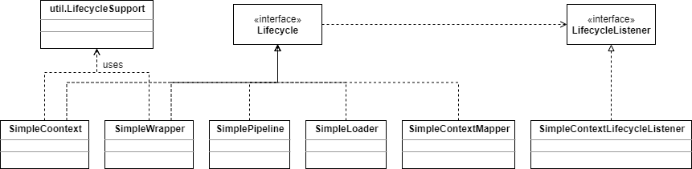

# 应用程序

本章的应用程序是构建在第5章的应用程序之上的，阐述了Lifecycle接口及其相关类型的使用。应用程序有一个context和两个wrapper，还有一个loader和一个mapper。应用程序的组件实现了Lifecycle接口，context里面使用了一个监听器。为了使程序简单点，这里没有使用第5章中的那两个阀。图6.1展示了这个应用程序的类图，注意，这里有一些接口（Container、Wrapper、Context、Loader和Mapper）和类（SimpleContextValve、SimpleContextMapper）没有包含在内。



SimpleContextLifecycleListener表示了SimpleContext的一个监听器。SimpleContextValve、SimpleContextMapper和SimpleWrapperValve和第5章一样，这里不再讨论他们。

## ex06.pyrmont.core.SimpleContext

SimpleContext和第5章很相似，但是现在它实现了Lifecycle接口。SimpleContext使用如下变量来引用一个LifecycleSuport实例：

```java
protected LifecycleSupport lifecycle = new LifecycleSupport(this);
```

使用一个名为started的布尔值来表示这个SimpleContext对象是否启动了。

它提供了Lifecycle里的方法的实现，下面是这些方法：

```java
public void addLifecycleListener(LifecycleListener listener) {
    lifecycle.addLifecycleListener(listener);
}

public LifecycleListener[] findLifecycleListeners() {
    return null;
}

public void removeLifecycleListener(LifecycleListener listener) {
    lifecycle.removeLifecycleListener(listener);
}

public synchronized void start() throws LifecycleException {
    if (started)
      	throw new LifecycleException("SimpleContext has already started");

    // Notify our interested LifecycleListeners
    lifecycle.fireLifecycleEvent(BEFORE_START_EVENT, null);
    started = true;
    try {
      	// Start our subordinate components, if any
      	if ((loader != null) && (loader instanceof Lifecycle))
        	((Lifecycle) loader).start();

      	// Start our child containers, if any
      	Container children[] = findChildren();
      	for (int i = 0; i < children.length; i++) {
        	if (children[i] instanceof Lifecycle)
          		((Lifecycle) children[i]).start();
      	}

      	// Start the Valves in our pipeline (including the basic),
      	// if any
      	if (pipeline instanceof Lifecycle)
        	((Lifecycle) pipeline).start();
      	// Notify our interested LifecycleListeners
      	lifecycle.fireLifecycleEvent(START_EVENT, null);
    }
    catch (Exception e) {
      e.printStackTrace();
    }

    // Notify our interested LifecycleListeners
    lifecycle.fireLifecycleEvent(AFTER_START_EVENT, null);
}

public void stop() throws LifecycleException {
    if (!started)
      	throw new LifecycleException("SimpleContext has not been started");
    // Notify our interested LifecycleListeners
    lifecycle.fireLifecycleEvent(BEFORE_STOP_EVENT, null);
    lifecycle.fireLifecycleEvent(STOP_EVENT, null);
    started = false;
    try {
      	// Stop the Valves in our pipeline (including the basic), if any
      	if (pipeline instanceof Lifecycle) {
        	((Lifecycle) pipeline).stop();
      	}

      	// Stop our child containers, if any
      	Container children[] = findChildren();
      	for (int i = 0; i < children.length; i++) {
        	if (children[i] instanceof Lifecycle)
          		((Lifecycle) children[i]).stop();
      	}
      	if ((loader != null) && (loader instanceof Lifecycle)) {
        	((Lifecycle) loader).stop();
      	}
    }
    catch (Exception e) {
      	e.printStackTrace();
    }
    // Notify our interested LifecycleListeners
    lifecycle.fireLifecycleEvent(AFTER_STOP_EVENT, null);
}
```

start()方法是怎么启动所有的子container和相关的组件，比如Loader、Pipeline和Mapper的呢？stop()方法又是如何停止这些的呢？为了启动这个container模块里的所有组件，你只需要启动更高层级的组件即可（本例中就是SimpleContext实例）。为了停止它们，你也只需要停止这一个组件即可。

start方法最开始会检查这个组件是否已经启动过了，如果启动过了，抛出LifecycleException异常：

```java
if (started)
	throw new LifecycleException("SimpleContext has already started");
```

然后它会触发BEFORE_START_EVENT事件

```java
// Notify our interested LifecycleListeners
lifecycle.fireLifecycleEvent(BEFORE_START_EVENT, null);
```

这样，SimpleContext中注册的每一个对该事件感兴趣的监听器都会收到通知。在本程序中，一个SimpleContextLifecycleListener类型的监听器会注册它自己，当我们讨论SimpleContextLifecycleListener时，你就可以看到这个监听器发生了什么。

接着，start方法会把started变量设置为true，表示这个组件已经启动了。

```java
started = true;
```

然后，start方法会启动所有的组件和它的子container。目前有两个组件实现了Lifecycle接口，SimpleLoader和SimplePipeline，子container有两个wrapper，这两个wrapper都是SimpleWrapper类型，都实现了Lifecycle接口。

```java
try {
    // Start our subordinate components, if any
    if ((loader != null) && (loader instanceof Lifecycle))
        ((Lifecycle) loader).start();

     // Start our child containers, if any
     Container children[] = findChildren();
     for (int i = 0; i < children.length; i++) {
        if (children[i] instanceof Lifecycle)
          	((Lifecycle) children[i]).start();
     }

     // Start the Valves in our pipeline (including the basic),
     // if any
     if (pipeline instanceof Lifecycle)
        ((Lifecycle) pipeline).start();
```

在所有的组件和子container启动后，会触发两个事件：START_EVENT和AFTER_START_EVENT。

```java
// Notify our interested LifecycleListeners
lifecycle.fireLifecycleEvent(START_EVENT, null);
...
// Notify our interested LifecycleListeners
lifecycle.fireLifecycleEvent(AFTER_START_EVENT, null);
```

stop()方法会首先检查这个实例是否已经启动了，如果没有就抛出LifecycleException。

```java
if (!started)
    throw new LifecycleException("SimpleContext has not been started");
```

然后触发BEFORE_STOP_EVENT和STOP_EVENT事件，并重置started变量：

```java
// Notify our interested LifecycleListeners
lifecycle.fireLifecycleEvent(BEFORE_STOP_EVENT, null);
lifecycle.fireLifecycleEvent(STOP_EVENT, null);
started = false;
```

接着，停止和这个实例关联的所有组件和它的子container:

```java
try {
   	// Stop the Valves in our pipeline (including the basic), if any
   	if (pipeline instanceof Lifecycle) {
        ((Lifecycle) pipeline).stop();
    }

    // Stop our child containers, if any
    Container children[] = findChildren();
    for (int i = 0; i < children.length; i++) {
        if (children[i] instanceof Lifecycle)
          	((Lifecycle) children[i]).stop();
    }
    if ((loader != null) && (loader instanceof Lifecycle)) {
        ((Lifecycle) loader).stop();
    }
}
```

最后触发AFTER_STOP_EVENT事件。

```java
// Notify our interested LifecycleListeners
lifecycle.fireLifecycleEvent(AFTER_STOP_EVENT, null);
```

## ex06.pyrmont.core.SimpleContextLifecycleListener

SimpleContextLifecycleListener代表了SimpleContext实例的一个监听器。

```java
package ex06.pyrmont.core;

import org.apache.catalina.Lifecycle;
import org.apache.catalina.LifecycleEvent;
import org.apache.catalina.LifecycleListener;

public class SimpleContextLifecycleListener implements LifecycleListener {

  public void lifecycleEvent(LifecycleEvent event) {
    Lifecycle lifecycle = event.getLifecycle();
    System.out.println("SimpleContextLifecycleListener's event " +
      event.getType().toString());
    if (Lifecycle.START_EVENT.equals(event.getType())) {
      System.out.println("Starting context.");
    }
    else if (Lifecycle.STOP_EVENT.equals(event.getType())) {
      System.out.println("Stopping context.");
    }
  }
}
```

lifecycleEvent方法的实现是很简单的，它只是简单打印触发的事件的类型。如果是一个START_EVENT事件，还会打印“Starting context”，如果是STOP_EVENT则会打印“Stopping context”。

## ex06.pyrmont.core.SimpleLoader

SimpleLoader类出了实现了Lifecycle接口外和第5章差不多。在Lifecycle接口的方法实现中，这个类并没有做啥事，只是简单地打印语句。因为实现了Lifecycle接口，它能够被关联的容器启动。

```java
public void addLifecycleListener(LifecycleListener listener) { } 
public LifecycleListener[] findLifecycleListeners() { 
    return null; 
} 
public void removeLifecycleListener(LifecycleListener listener) { } 
public synchronized void start() throws LifecycleException { 
    System.out.println("Starting SimpleLoader"); 
} 
public void stop() throws LifecycleException { }
```

## ex06.pyrmont.core.SimplePipeline

SimplePipeline除了实现了Pipeline接口，还实现了Lifecycle接口。Lifecycle接口中声明的方法这里都留空了，但是，它已经可以被关联的容器启动了。其他的部分和第5章中的一样。

## ex06.pyrmont.core.SimpleWrapper

这个类和第5章中的类似。在本应用程序中，它实现了Lifecycle接口，所以它可以被它的父container启动。对于Lifecycle接口中的方法，SimpleWrapper大部分留空除了start和stop方法。

```java
public void addLifecycleListener(LifecycleListener listener) { } 
public LifecycleListener[] findLifecycleListeners() { 
    return null; 
} 
public void removeLifecycleListener(LifecycleListener listener) { }

public synchronized void start() throws LifecycleException { 
    System.out.println("Starting Wrapper " + name); 
    if (started) 
        throw new LifecycleException("Wrapper already started"); 
    // Notify our interested LifecycleListeners 	
    lifecycle.fireLifecycleEvent(BEFORE_START_EVENT, null); 
    started = true; 
    
    // Start our subordinate components, if any 
    if ((loader != null) && (loader instanceof Lifecycle)) 
        ((Lifecycle) loader).start(); 
    // Start the Valves in our pipeline (including the basic), if any 
    if (pipeline instanceof Lifecycle) 
        ((Lifecycle) pipeline).start(); 
    // Notify our interested LifecycleListeners 
    lifecycle.fireLifecycleEvent(START_EVENT, null);
    // Notify our interested LifecycleListeners	
    lifecycle.fireLifecycleEvent(AFTER_START_EVENT, null); 
} 

public void stop() throws LifecycleException {
	System.out.println("Stopping wrapper " + name); 
    // Shut down our servlet instance (if it has been initialized) 
    try { 
        instance.destroy(); 
    } catch (Throwable t) { 
    } 
    instance = null; 
    if (!started) 
        throw new LifecycleException("Wrapper " + name + " not started"); 
    // Notify our interested LifecycleListeners
    lifecycle.fireLifecycleEvent(BEFORE_STOP_EVENT, null); 
    // Notify our interested LifecycleListeners 
    lifecycle.fireLifecycleEvent(STOP_EVENT, null); 
    started = false; 
    // Stop the Valves in our pipeline (including the basic), if any 
    if (pipeline instanceof Lifecycle) { 
        ((Lifecycle) pipeline).stop(); 
    } 
    // Stop our subordinate components, if any 
    if ((loader != null) && (loader instanceof Lifecycle)) { 
        ((Lifecycle) loader).stop(); 
    } 
    // Notify our interested LifecycleListeners
	lifecycle.fireLifecycleEvent(AFTER_STOP_EVENT, null); 
}
```

SimpleWrapper的start方法和SimpleContext的start方法很相似。它启动添加的所有组件并触发BEFORE_START_EVENT、START_EVENT和AFTER_START_EVENT事件。

它的stop方法更加有趣。在打印了一条简单的字符串后，它会调用servlet实例的destory方法。

```java
System.out.println("Stopping wrapper " + name); 
// Shut down our servlet instance (if it has been initialized) 
try { 
    instance.destroy(); 
} catch (Throwable t) { 
} 
instance = null; 
```

然后检查这个wrapper是否启动了，如果没有，抛出LifecycleException。

```java
if (!started) 
    throw new LifecycleException("Wrapper " + name + " not started"); 
```

接着，触发BEFORE_STOP_EVENT和STOP_EVENT事件，并重置started变量。

```java
// Notify our interested LifecycleListeners
lifecycle.fireLifecycleEvent(BEFORE_STOP_EVENT, null); 
// Notify our interested LifecycleListeners 
lifecycle.fireLifecycleEvent(STOP_EVENT, null); 
started = false; 
```

然后，停止关联的loader和pipeline组件，在本例中，没有loader。

```java
// Stop the Valves in our pipeline (including the basic), if any 
if (pipeline instanceof Lifecycle) { 
    ((Lifecycle) pipeline).stop(); 
} 
// Stop our subordinate components, if any 
if ((loader != null) && (loader instanceof Lifecycle)) { 
    ((Lifecycle) loader).stop(); 
} 
```

最后，触发AFTER_STOP_EVENT事件。

```java
// Notify our interested LifecycleListeners
lifecycle.fireLifecycleEvent(AFTER_STOP_EVENT, null);
```

