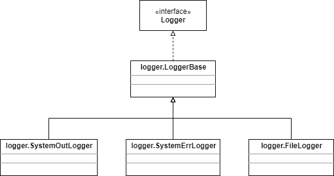

# Tomcat里的日志记录器

Tomcat提供了三个日志记录器：FileLogger、SystemErrLogger和SystemOutLogger。它们都在org.apache.catalina.logger包下，它们都继承了org.apache.catalina.logger.LoggerBase类。在Tomcat 4里，LoggerBase实现了Logger接口，在Tomcat 5里，它还实现了Lifecycle（第6章已经讨论过了）和MBeanRegistration（会在第20章解释）接口。 

下面是这些类的类图



## The LoggerBase Class

Tomcat 5里面的LoggerBase类是相当完整的，它包含了创建MBeans的代码，我们会在第20章的时候讨论它。现在我们来看看Tomcat 4里的LoggerBase。

LoggerBase是一个抽象类，它提供了Logger接口里除了log(String msg)方法以外的其他所有方法的实现。

```java
public abstract void log(String msg);
```

它的子类会提供了这个方法的实现，其他重载的log方法都会调用这个实现。因为每一个子类会把信息记录到不同的地方，所以在LoggerBase里面这个方法是留空的。

在这个类里，一个名叫verbosity的protected变量定义了日志级别，它的默认值是ERROR：

```java
protected int verbosity = ERROR;
```

日志级别可以通过调用setVerbosity方法来改变，向这个方法传递如下的字符串：FATAL、ERROR、WARNING、INFORMATION或者DEBUG。下面就是这个方法的实现：

```java
public void setVerbosityLevel(String verbosity) {
    if ("FATAL".equalsIgnoreCase(verbosity))
        this.verbosity = FATAL;
    else if ("ERROR".equalsIgnoreCase(verbosity))
        this.verbosity = ERROR;
    else if ("WARNING".equalsIgnoreCase(verbosity))
        this.verbosity = WARNING;
    else if ("INFORMATION".equalsIgnoreCase(verbosity))
        this.verbosity = INFORMATION;
    else if ("DEBUG".equalsIgnoreCase(verbosity))
        this.verbosity = DEBUG;
}
```

有两个log方法会接收一个integer类型的参数作为日志级别。在这两个重载的方法里面，log(String message)方法只有在传入的integer小于等于这个对象的verbosity变量时才会被调用，下面是这两个重载的方法：

```java
public void log(String message, int verbosity) {
    if (this.verbosity >= verbosity)
        log(message);
}

public void log(String message, Throwable throwable, int verbosity) {
    if (this.verbosity >= verbosity)
        log(message, throwable);
}
```

接下来会讨论它的三个子类，子类里面实现了这个log(String message)方法。

## The SystemOutLogger Class

SystemOutLogger提供了log(String message)方法的实现，收到的每一条信息都传递给System.out.println方法进行打印。

```java
package org.apache.catalina.logger;

public class SystemOutLogger extends LoggerBase {
    protected static final String info = "org.apache.catalina.logger.SystemOutLogger/1.0";
    
    public void log(String msg) {
        System.out.println(msg);
    }
}
```

## The SystemErrLogger Class

这个类和SystemOutLogger类类似，但是它的log(String message)方法是把收到的信息传递给System.err.println()方法。

```java
package org.apache.catalina.logger;

public class SystemErrLogger extends LoggerBase {
    protected static final String info = "org.apache.catalina.logger.SystemErrLogger/1.0";
    
    public void log(String msg) {
        System.err.println(msg);
    }
}
```

## The FileLogger Class

FileLogger是LoggerBase的子类中最复杂的。它把从关联的container中收到的信息写到一个文件中，并且可以为每条信息选择是否添加时间戳。第一次实例化时，会创建一个文件，文件的名字包含今天的日期信息。如果日期改变了，它会创建一个新的文件，新的文件包含新的日期，信息也会写入到写的文件中。这个类也允许你在日志文件名中添加前缀或者后缀。

在Tomcat 4中，这个类实现了Lifecycle接口，所以它能够像其他实现了Lifecycle接口的组件一样启动和停止。而在Tomcat 5中，是由它的父类LoggerBase来实现了这个接口。

在Tomcat 4的FileLogger中，start和stop方法除了触发启动和停止文件日志记录器事件外，并没有做其他的事。注意，stop方法中还会调用私有方法close来关闭日志文件。

```java
public void start() throws LifecycleException {
    // Validate and update our current component state
    if (started)
        throw new LifecycleException(sm.getString("fileLogger.alreadyStarted"));
    lifecycle.fireLifecycleEvent(START_EVENT, null);
    started = true;
}

public void stop() throws LifecycleException {
    // Validate and update our current component state
    if (!started)
        throw new LifecycleException(sm.getString("fileLogger.notStarted"));
        lifecycle.fireLifecycleEvent(STOP_EVENT, null);
        started = false;
        close();
}
```

FileLogger类中最重要的方法是log方法，如下：

```java
public void log(String msg) {
    // Construct the timestamp we will use, if requested
    Timestamp ts = new Timestamp(System.currentTimeMillis());
    String tsString = ts.toString().substring(0, 19);
    String tsDate = tsString.substring(0, 10);

    // If the date has changed, switch log files
    if (!date.equals(tsDate)) {
        synchronized (this) {
            if (!date.equals(tsDate)) {
                close();
                date = tsDate;
                open();
            }
        }
    }

    // Log this message, timestamped if necessary
    if (writer != null) {
        if (timestamp) {
            writer.println(tsString + " " + msg);
        } else {
            writer.println(msg);
        }
    }
}
```

log方法接收信息并把信息写入日志文件。在一个FileLogger实例的生命周期内，log方法可能会打开或者关闭多个日志文件。典型的，如果日期改变了，log方法会关闭当前文件并打开一个新的文件。让我们来看看它是怎样打开、关闭以及log方法是如何工作的。

### The open method

open方法如下，它会在指定的目录创建一个新的日志文件。

```java
private void open() {
    // Create the directory if necessary
    File dir = new File(directory);
    if (!dir.isAbsolute())
        dir = new File(System.getProperty("catalina.base"), directory);
    dir.mkdirs();

    // Open the current log file
    try {
        String pathname = dir.getAbsolutePath() + File.separator + prefix + date + suffix;
        writer = new PrintWriter(new FileWriter(pathname, true), true);
    } catch (IOException e) {
        writer = null;
    }
}
```

open方法首先检查要创建的日志文件所在的目录是否存在，如果目录不存在，就会先创建目录。目录保存在directory变量中。

```java
File dir = new File(directory);
if (!dir.isAbsolute())
    dir = new File(System.getProperty("catalina.base"), directory);
dir.mkdirs();
```

然后，基于目录路径、前缀、当前日期以及后缀来组装要打开的文件的pathname

```java
String pathname = dir.getAbsolutePath() + File.separator + prefix + date + suffix;
```

构建java.io.PrintWriter实例，它的writer是一个java.io.FileWriter对象。这个PrintWriter实例会赋值给writer变量，log方法会使用这个writer来记录信息

```java
writer = new PrintWriter(new FileWriter(pathname, true), true);
```

### The close method

close方法会刷新PrintWriter的内容，关闭这个PrintWriter实例，设置writer为null并将date变量设置为空字符串。

```java
private void close() {
    if (writer == null)
        return;
    writer.flush();
    writer.close();
    writer = null;
    date = "";
}
```

### The log method

log方法首先会创建一个java.sql.Timestamp实例，它是java.util.Date的一个瘦包装器。实例化Timestamp的目的是为了能够更简单地获取当前日期。通过传递当前时间就可以构造一个Timestamp实例：

```java
Timestamp ts = new Timestamp(System.currentTimeMillis());
```

调用Timestamp的toString方法，就能够得到当前日期的字符串表示。toString输出的格式是像下面这样的：

```java
yyyy-mm-dd hh:mm: SS.fffffffff
```

其中fffffffff表示从00:00:00起经过的纳秒数。为了提取日期和小时，就调用字符串的substring方法：

```java
String tsString = ts.toString().substring(0, 19); 
```

从tsString获取日期部分：

```java
String tsDate = tsString.substring(0, 10);
```

比较tsDate和变量date是否相等，初始化时date是一个空字符串。如果不等，就关闭当前文件，把tsDate赋值给date变量，并打开一个新的日志文件。

```java
// If the date has changed, switch log files 
if (!date.equals(tsDate)) { 
    synchronized (this) { 
        if (!date.equals(tsDate)) { 
            close(); 
            date = tsDate; 
            open(); 
        } 
    } 
} 
```

最后，向PrintWriter中写信息，PrintWriter的输出流就是那个日志文件。如果变量timestamp的值为true，在信息前面就会加上前缀时间戳（tsString），否则就只是写入信息。

```java
// Log this message, timestamped if necessary 
if (writer != null) { 
    if (timestamp) { 
        writer.println(tsString + " " + msg); 
    } 
    else { 
        writer.println(msg); 
    } 
}
```


