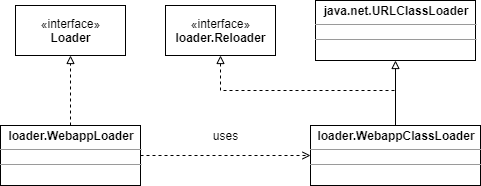

# The Loader Interface

在WEB应用中加载servlet和其他类时有一些规则，比如，servlet能够使用部署到WEB-INF/classes目录及其子目录下的类，但是它不能访问其他的类，即使这些类在CLASSPATH中。同样，servlet也只能够访问部署在WEB-INF/lib目录下的类库，而不能访问其他目录下的类库。

Tomcat的loader代表的是一个web应用的loader而不是一个类加载器。loader必须实现org.apache.catalina.Loader接口。loader的实现使用了一个自定义的org.apache.catalina.loader.WebappClassLoader类加载器，你可以通过调用Loader接口的getClassLoader方法来获得这个类加载器。

此外，Loader接口还定义了一些方法来处理仓库的集合。web应用的WEB-INF/classes和WEB-INF/lib目录会作为仓库被添加。Loader接口的addRepository方法用来添加一个仓库，findRepositories方法返回一个所有仓库的数组。

一个Tomcat的loader实现通常会与一个context关联，getContainer和setContainer方法就是用来建立这种关联的。如果修改了一个或者多个context里的类，loader也支持重新加载。因此，servlet程序猿能够重新编译servlet及其相关类，新的类会重新加载而不必重新启动Tomcat。为了重新加载目标，Loader接口提供了一个modified方法，在loader的实现中，如果仓库中的类有修改，这个modified方法会返回true，就需要重新加载。loader不会重新加载它自己，而是会调用Context接口的reload方法。另外两个方法：setReloadable和getReloadable，是用来设置或判断是否可以重新加载。默认的，在标准的Context的实现（org.apache.catalina.core.StandardContext）中，是不支持重新加载的。为了使一个context能够重新加载，需要在在server.xml文件中添加一个Context元素，就像下面这样：

```xml
<Context path="/myApp" docBase="myApp" debug="0" reloadable="true" />
```

此外，loader的实现会指明是否要委派给父loader，Loader接口提供了getDelegate和setDelegate方法。

```java
package org.apache.catalina;

import java.beans.PropertyChangeListener;

public interface Loader {
    public ClassLoader getClassLoader();
    public Container getContainer();
    public void setContainer(Container container);
    public DefaultContext getDefaultContext();
    public void setDefaultContext(DefaultContext defaultContext);
    public boolean getDelegate();
    public void setDelegate(boolean delegate);
    public String getInfo();
    public boolean getReloadable();
    public void setReloadable(boolean reloadable);
    public void addPropertyChangeListener(PropertyChangeListener listener);
    public void addRepository(String repository);
    public String[] findRepositories();
    public boolean modified();
    public void removePropertyChangeListener(PropertyChangeListener listener);
}
```

Catalina提供了org.apache.catalina.loader.WebappLoader作为Loader接口的实现，WebappLoader包含了一个org.apache.catalina.loader.WebappClassLoader实例作为它里面的类加载器，WebappClassLoader继承于java.net.URLClassLoader。

注意：当关联了loader的容器需要用到servlet时，它会首先调用loader的getClassLoader方法获取类加载器，然后调用这个类加载器的loadClass方法来加载servlet。更详细的内容会在第11章中讨论。

Loader接口和它的实现类类图如下：

