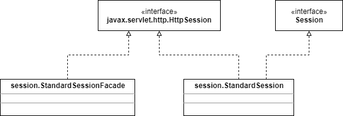

# Sessions

在servlet程序中，javax.servlet.http.HttpSession接口代表了一个session对象，这个接口的实现类是org.apache.catalina.session包中的StandardSession类。但是，由于安全方面的原因，manager并不能向servlet传递StandardSession，它使用了一个外观类StandardSessionFacade。在内部，manager还使用了另一个外观类：org.apache.catalina.Session接口，下面展示了相关的类图，注意：Session, StandardSession, and StandardSessionFacade省略了前缀org.apache.catalina。



## The Session Interface

Session接口作为Catalina内部的外观类，它的标准实现StandardSession也实现了javax.servlet.http.HttpSession接口。

```java
package org.apache.catalina;

import java.security.Principal;
import java.util.Iterator;
import javax.servlet.http.HttpSession;

public interface Session {

    public static final String SESSION_CREATED_EVENT = "createSession";
    public static final String SESSION_DESTROYED_EVENT = "destroySession";

    public String getAuthType();
    public void setAuthType(String authType);
    public long getCreationTime();
    public void setCreationTime(long time);
    public String getId();
    public void setId(String id);
    public String getInfo();
    public long getLastAccessedTime();
    public Manager getManager();
    public void setManager(Manager manager);
    public int getMaxInactiveInterval();
    public void setMaxInactiveInterval(int interval);
    public void setNew(boolean isNew);
    public Principal getPrincipal();
    public void setPrincipal(Principal principal);
    public HttpSession getSession();
    public void setValid(boolean isValid);
    public boolean isValid();
    public void access();
    public void addSessionListener(SessionListener listener);
    public void expire();
    public Object getNote(String name);
    public Iterator getNoteNames();
    public void recycle();
    public void removeNote(String name);
    public void removeSessionListener(SessionListener listener);
    public void setNote(String name, Object value);
}
```

Session对象总是包含在manager中，setManager和getManager方法用来关联manager。Session实例在与其管理器关联的上下文中有唯一的标识符，session的标识符可以通过setId和getId方法访问。getLastAccessedTime方法会被它的管理器调用，来判断这个session对象的有效性。管理器调用setValid方法来设置或者重置一个session对象的有效性。每次访问一个session对象，它的access方法都会被调用来更新它的最后访问时间。管理器能够调用expire方法来终止一个会话，也能够调用getSession方法来返回一个用这个外观类包装的HttpSession对象。

## The StandardSession Class

StandardSession类是Session接口的标准实现。为了实现javax.servlet.http.HttpSession和org.apache.catalina.Session接口，它还实现了java.lang.Serializable接口使得session对象能够序列化。

这个类的构造器接收一个Manager实例，使得这个session对象总是会有一个管理器。

```java
public StandardSession(Manager manager);
```

下面是一些用于维护状态的重要的私有变量，注意，带有transient关键字的变量无法序列化。

```java
// session attributes 
private HashMap attributes = new HashMap(); 
// the authentication type used to authenticate our cached Principal, if any 
private transient String authType = null; 
private long creationTime = 0L; 
private transient boolean expiring = false; 
private transient StandardSessionFacade facade = null; 
private String id = null; 
private long lastAccessedTime = creationTime; 
// The session event listeners for this Session.
private transient ArrayList listeners = new ArrayList(); 
private Manager manager = null; 
private int maxInactiveInterval = -1; 
// Flag indicating whether this session is new or not. 
private boolean isNew = false; 
private boolean isValid = false; 
private long thisAccessedTime = creationTime;
```

注：在Tomcat 5中以上的变量都是protected的，而在Tomcat 4中它们是私有的。每一个变量都有get/set方法。

getSession方法传递自身实例，创建一个StandardSessionFacade对象

```java
public HttpSession getSession() { 
    if (facade == null) 
        facade = new StandardSessionFacade(this); 
    return (facade); 
}
```

如果一个session对象在maxInactiveInterval变量值的周期内都没有被访问过，它会被管理器终止。通过调用Session接口的expire方法可以终止一个session对象，Tomcat 4中的StandardSession的该方法实现如下：

```java
    public void expire(boolean notify) {

        // Mark this session as "being expired" if needed
        if (expiring)
            return;
        expiring = true;
        setValid(false);

        // Remove this session from our manager's active sessions
        if (manager != null)
            manager.remove(this);

        // Unbind any objects associated with this session
        String keys[] = keys();
        for (int i = 0; i < keys.length; i++)
            removeAttribute(keys[i], notify);

        // Notify interested session event listeners
        if (notify) {
            fireSessionEvent(Session.SESSION_DESTROYED_EVENT, null);
        }

        // Notify interested application event listeners
        // FIXME - Assumes we call listeners in reverse order
        Context context = (Context) manager.getContainer();
        Object listeners[] = context.getApplicationListeners();
        if (notify && (listeners != null)) {
            HttpSessionEvent event =
              new HttpSessionEvent(getSession());
            for (int i = 0; i < listeners.length; i++) {
                int j = (listeners.length - 1) - i;
                if (!(listeners[j] instanceof HttpSessionListener))
                    continue;
                HttpSessionListener listener =
                    (HttpSessionListener) listeners[j];
                try {
                    fireContainerEvent(context,
                                       "beforeSessionDestroyed",
                                       listener);
                    listener.sessionDestroyed(event);
                    fireContainerEvent(context,
                                       "afterSessionDestroyed",
                                       listener);
                } catch (Throwable t) {
                    try {
                        fireContainerEvent(context,
                                           "afterSessionDestroyed",
                                           listener);
                    } catch (Exception e) {
                        ;
                    }
                    // FIXME - should we do anything besides log these?
                    log(sm.getString("standardSession.sessionEvent"), t);
                }
            }
        }

        // We have completed expire of this session
        expiring = false;
        if ((manager != null) && (manager instanceof ManagerBase)) {
            recycle();
        }

    }
```

终止会话的处理包含了内部变量expiring的设置，从管理器中移除该session对象，并触发某些事件。

## The StandardSessionFacade Class

要传递一个Session对象给servlet，Catalina可以实例化一个StandardSession对象，填充属性并把它传给servlet。但是，Catalina并没有这样做，它传递给servlet的是一个StandarSessionFacade对象，这个对象只提供了HttpSession接口里面的方法的实现。这样，servlet程序员就不能把这个HttpSession对象向下转型回StandarSession，就不能访问StandarSession中某些敏感的方法。

