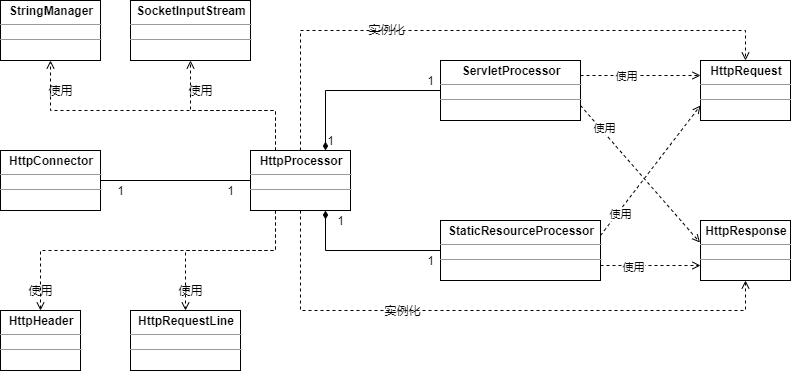

# 应用程序

# 应用程序

从本章开始，每章的应用程序都会按照模块进行划分。本章的应用程序包含三个模块：connector, startup和core。

startup模块只有一个类，Bootstrap，它负责启动应用程序。connector模块的类可以分为五类：

- 连接器及其支持类（HttpConnector和HttpProcessor）
- HTTP请求类（HttpRequest）及其支持类
- HTTP相应类（HttpResponse）及其支持类
- 外观类（HttpRequetFacade和HttpResponseFacade）
- 常量类

core模块有两个类：ServletProcessor和StaticResourceProcessor。

图3.1展示了这个应用程序的UML类图。为了使类图更可读，省略了HttpRequest和HttpResponse相关的类。在我们讨论Request和Response的时候，你会看到他们各自的UML类图。

​																				图  3.1

和图2.1相比，第2章中的HttpServer类拆分成了两个类：HttpConnector和HttpProcessor，HttpRequest替代了Request，HttpResponse替代了Response。本章的应用程序也使用了更多的类。

第2章中的HttpServer负责等待HTTP请求并创建请求和响应对象，在本章中，等待HTTP请求的任务交给了HttpConnector，创建请求和响应对象的任务交给了HttpProcessor。

本章中，HttpRequest表示请求对象，它实现了HttpServletRequest接口，会作为servlet的service方法的参数。因此，每一个HttpRequest对象需要正确地设置它的属性以供servlet使用，包括URI、query string、cookies、parameters和其他头信息等。因为connector不知道servlet需要哪些值，所以它会解析请求中的所有值。但是解析请求又比较耗资源，如果能够只解析servlet需要的信息将会节省大量的CPU。例如，如果servlet不需要请求的parameter信息（即它不会调用HttpServletRequest的getParameter、getParameter、getParameterNames和getParameterValues方法），connector就不需要从query string或者request body中解析这些参数信息。Tomcat默认的连接器会尽量在servlet需要的时候再去解析这些参数。

Tomcat默认的连接器和我们的连接器都使用SocketInputStream从socket的InputStream中读取字节流。SocketInputStream包装InputStream，InputStream由socket的getInputStream方法获得。SocketInputStream有两个重要的方法：readRequestLine和readHeader。readRequestLine返回请求的第一行，包括URI，请求方法和HTTP版本。处理从socket的输入流而来的字节流意味着从第一个字节读到最后一个字节（而且不能向前读），所以readRequestLine只能被调用一次，而且必须在readHeader调用之前调用。每次调用readHeader都会获得一个header的键值对，应该重复调用它直到headers的信息都被读取完。readRequestLine的返回值是一个HttpRequestLine对象，readHeader的返回值是一个HttpHeader对象。我们会在后面的章节讨论HttpRequestLine和HttpHeader。

HttpProcessor创建HttpRequest对象并设置它的属性，HttpProcessor使用它的parse方法解析请求的第一行和请求头，解析的结果设置到HttpRequest对象的属性上去。但是，这个解析方法并不会解析body和query string中的参数，这个任务会留给HttpRequest，只有当servlet需要这些参数的时候才会去解析。

对于先前应用程序的另一个改善是使用启动类Bootstrap来启动应用程序。

我们会在后面的几节中详细解释这个应用程序。